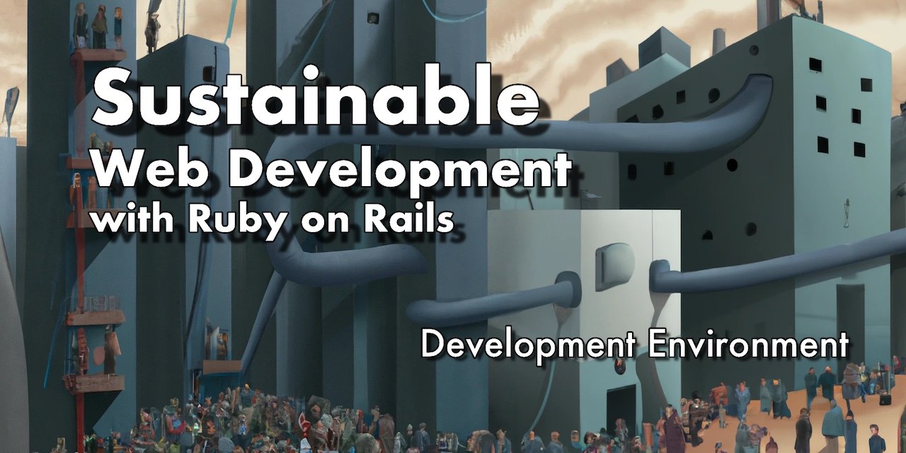

# Dev Environment for the Sustainable Rails Book

This is the dev environment used in the book [Sustainable Web Development with Ruby on Rails](https://sustainable-rails.com).
It's here primarily to allow readers to follow along.




## How to Use

1. Ensure you have Docker installed
1. Clone this repo
1. `dx/build` - this will build a *Docker image* you will use to *start a container* in which development can happen
1. `dx/start` - this will use *Docker Compose* to start three *containers*: a linux dev box using the image you built in the previous step (which is where you will run Rails), Postgres, and Redis.
1. In another terminal, you can do `dx/exec bash` to get a prompt into the container where you will do dev work.  You can also issue commands directly, e.g. `dx/exec rails --help`

## What is What

This is not a Docker tutorial, but basically:

* Docker runs *containers*, which are like virtual computers
* Each container is based on an *image* which is like a cloned hard drive you can use to run inside a computer
* An image is built by a *Dockerfile* which describes what goes into the image
* *Docker Compose* can run multiple containers networked together

`Dockerfile.dx` creates an image that has a Ruby dev environment in it.  That image, when run via `dx/start` will have access to
a Postgres (via the host `db`) and a Redis (via the host `redis`).  The Rails app you will build will be available via
`localhost:9999`

```
[ Your Computer ]
           |
           |
           |
           |
           |    +-----------------------+
           v    |                       |
         {9999}-+ sustainable-rails-dev |
                |                       |
                | «rails app/ruby dev»  |
                +-------+---------------+
                          |
                          |
                      +---+---+
   ______________     |       |       __________
  /             /|    |       |      /         /|
 +--------------+|    |       |     +----------+|
 |              ||    v       v     |          ||
 |     db-------+---{5432}  {6379}--+--redis   ||
 |              ||                  |          ||
 | «Postgres»   |/                  | «Redis»  |/
 +--------------+                   +----------+ 
```

### Files and What They Are For
The scripts are in `dx/` and all respond to `-h`, but here is what they all do:

* `Dockerfile.dx` - Used to create the dev environment container. It is heavily commented so you can see what is doing what.
* `docker-compose.dx.yml` - Used to start up the networked services described above. It is commented to explain a few things.
* `dx/` - holds automation scripts. These should all respond to `-h`
  - `dx/build` - Builds an image from `Dockerfile.dx`
  - `dx/docker-compose.env` - common configuration needed between the scripts and `docker-compose.dx.yml`
  - `dx/dx.sh.lib` - shared bash functionality between the scripts
  - `dx/exec` - Wraps `docker compose exec` to run commands in a running container
  - `dx/setupkit.sh.lib` - Other common base functionality
  - `dx/show-help-in-app-container-then-wait.sh` - Script that is run inside the dev container to keep it running. This is for use *inside* the Docker container
  - `dx/start` - Starts up all the containers using Docker Compose
  - `dx/stop` - Stops th containers (though you can use Ctrl-C in the terminal where you ran `dx/start`
* `README.md` - this file

## Can You Use this For Your Rails App? How?

Yes, you could use this as the basis for a dev environment for your Rails app.  ["Sustainable Dev Environments with Docker and Bash"](https://devbox.computer) expands greatly on how this all works if you want a deeper dive.

To use this for your app:

1. Copy the files in this repo to your app or clone it using GitHub's template repository feature.
1. Edit `dx/docker-compose.env` and change the values there:
   - `IMAGE` should be in format `«org»/«repo»:«tag»`, where:
      * `«org»` is your org on Docker Hub or GitHub (doesn't really matter and could be omitted)
      * `«repo»` should be the name of your app, suffixed with `-dev`. It technically doesn't matter, but it's used to build a dev image, not one for production, so using `-dev` suffix helps communicate that.
      * `«tag»` should be `ruby-3.2` since the image is based on Ruby's 3.2 image.  You want this tag to be a version relevant to
      the *environment*, not your app.
   - `PROJECT_NAME` and `DEFAULT_SERVICE` should ideally be the same and be either simply `app` or the name of your app, without
   spaces, formatted to be a valid hostname.  These values are used in Docker Compose to start your app's dev environment
   container up.
1. Edit `Dockerfile.dx` to add any additional tooling your app needs to work.
1. `dx/build`
1. `dx/start`
1. etc.

## Colophon

* This repo is synced from a private repo where the book is developed.  These are the actual files the book uses to execute the code.
* The social image was created in Pixelmator based on a 35mm photo I took of the House of Eyrabakki in Iceland. Text is set in Helvetica Neue.
* All content was [created without any assistance from a Generative AI](https://declare-ai.org/1.0.0/none.html).

